# Report

This report shows the latest benchmarks for the performance of the
`large-records` library.

In most of these benchmarks one of the main things we measure is the size of the
`ghc` core. While this is not in and of itself a useful measure, it is a useful
proxy for what we _are_ interested in (compilation time and memory usage), and
we can measure it much more accurately). When reporting core size, we report the
size of the core after desugaring (`ds-preopt`), after the
[very simple optimiser][very-simple-optimiser]
(`ds`), and after the simplifier (`simpl`).

Note on the use of color: In the plots we intentionally do not use different
colors to differentiate between these phases, using color to emphasize the
difference between different approaches instead. When a particular phase
requires a separate explanation, we will use a separate plot. We will use red
(and occassionally blue) for approaches that do not work, and green for the
approach that we have adopted.

Compilation time in these benchmarks is as reported by `-ddump-timings`,
compiling with `-O0` (the primary goal here is to speed up the development
cycle). We measure this _without_ also using any of the core dump options
(`-ddump-ds-preopt`, `-ddump-ds`, or `-ddump-simpl`). This is important, because
not only do these flags affect compilation time, they may do so non-linearly if
part of the tree is never actually forced.

All measurements are done with `ghc` 8.8.4 as this is the version of `ghc` used
by the client for whom this work was done ([Juspay](https://juspay.in/)). The
only exception is the `NoFieldSelectors` experiment, see below.

## Benchmarks for `large-records`

### Benchmark: "Before vs After"

This is one of the main benchmarks of the library, and is described in more
detail in [Avoiding quadratic core code size with large records][blogpost1]. It
measures the compilation cost of compiling a module containing

- Record of a certain size
- Stock-derived `Eq` and `Show` instances
- TH-derived [`generics-sop`][generics-sop] `Generic` instance
- `HasField` instance derived by the [`RecordDotPreprocessor`][RDP] plugin
- `ToJSON` instance in terms of [`gtoJSON`][json-sop]

(this is the "Before"), and compares that to a module containing the same
ingredients, but with

- Record representation generated by `large-records`
- `Eq`, `Show`, `Generic` (for [`large-generics`][large-generics] generics)
  and `HasField` instances all generated by `large-records`
- `ToJSON` instance in terms of the `large-generics` equivalent of
  [`gtoJSON`][large-generics-json].

(this is "After").

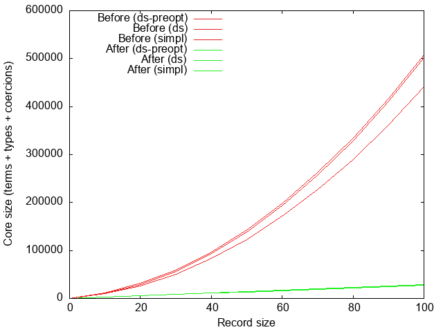
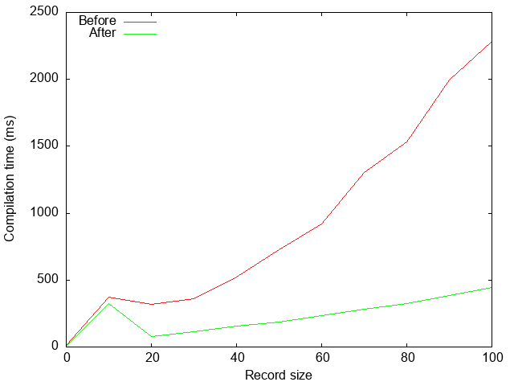

### Benchmark: "HigherKinded"

This benchmark is mostly a sanity check: it repeats the "After" benchmark,
but using a higher kinded record (that is, a record with a functor parameter,
like is common for example in `beam` applications).

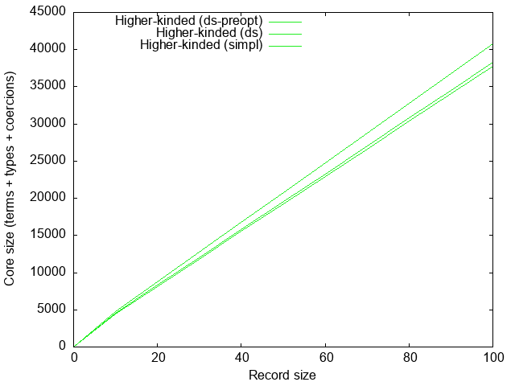
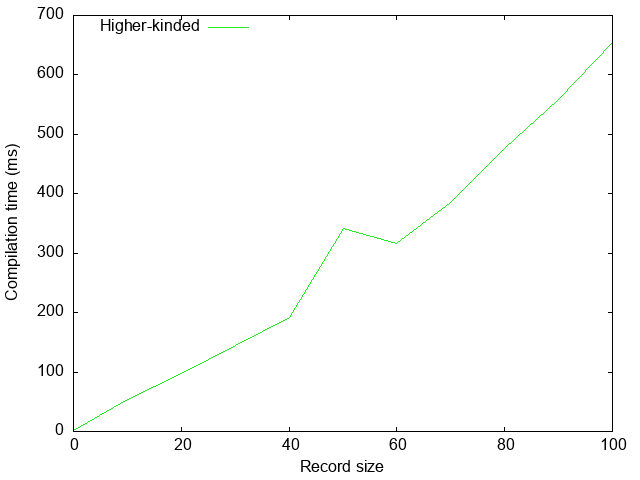

### Benchmark: "HasNormalForm"

`HasNormalForm` is an ingredient in how we deal with generic transforms.
We described this only very briefly in the blog post (section
[Transforms][blogpost1-transforms]),
but discussed it in a bit more detail in the Haskell eXchange presentation
about the `large-records` library
[Avoiding Quadratic Blow-up During Compilation][HaskellX]
(section "Avoiding evidence", starts around 41:35).

Although the size of the core before the [very simple
optimiser][very-simple-optimiser] runs is still quadratic (and huge!):

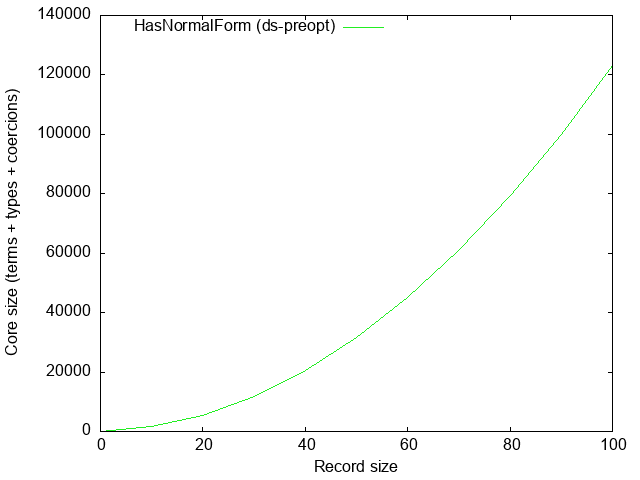

the very simple optimiser cleans this up to exactly nothing (this is what I
describe in the talk):

Provided that the full tree before the very simple optimiser is never fully
forced (and normally it isn't), compilation time is still fine:

## Benchmarks for `large-anon`

### Record construction

This uses the source plugin, but it offers merely syntactic sugar, it does not
use any unsafe features from the library; you could instead just write these
as repeated inserts. The library _does_ offer experimental integration with
`typelet`, which confirms that the only source of non-linear core size is indeed
the lack of type sharing in the type arguments to `insert`. However, as the
benchmarks show, this does not actually result in an improvement in compilation
time (at least, not for this benchmark): compilation time is nicely linear
without.

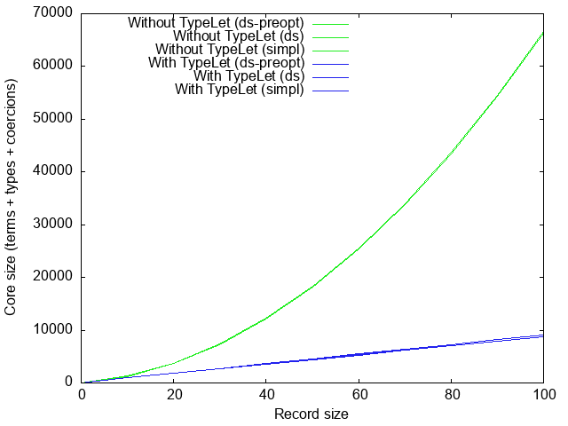
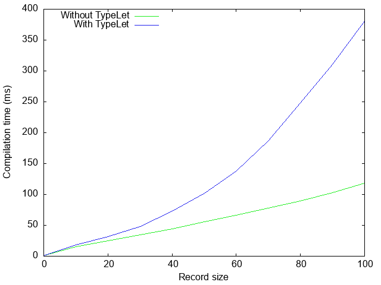

Comparison with [`superrecord`][superrecord]:

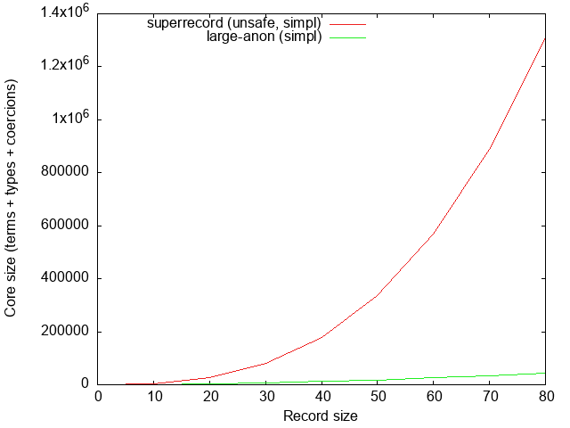

## Experiments

In this section we report on a number of experiments that test various
approaches used in the `large-records` library, independent of the details of
the full library. Indeed, these experiments do not use the `large-records`
library at all.

### Simple record

This experiment isolates the just cost of having a record with many fields.
This cost is due to the record accessors, as discussed in section
[Warmup: terms][blogpost1-recordaccessors] of the first blogpost.

Note that this cost is _not_ prevented by the use of `NoFieldSelectors`: even
when using this language pragma, field selectors are _still_ created, they just
won't pollute the namespace (they are used for `HasField` instances).

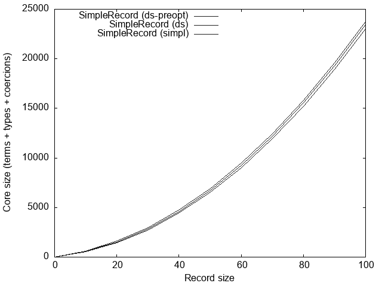
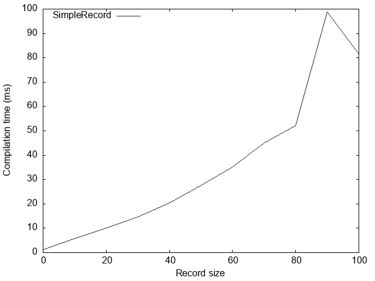

### Pattern synonyms vs `NoFieldSelectors`

This experiment checks that `NoFieldSelectors` indeed makes it possible to
define record pattern synonyms without incurring a quadratic cost. Since
`NoFieldSelectors` was introduced only in `ghc` 9.2.1, this is the only
experiment ran with that version of `ghc` (and we currently make no use of
this feature).

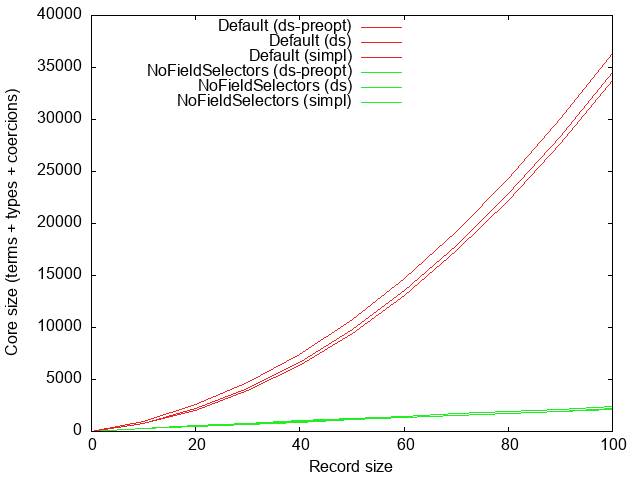
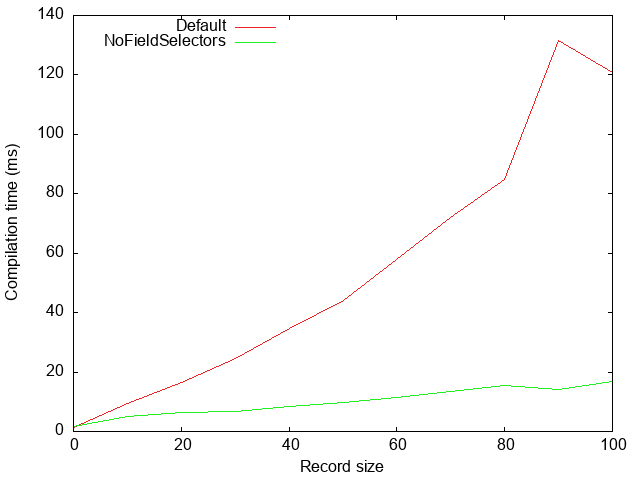

### Superclasses

This is a simple experiment that measures the cost of having many superclasses.
This cost turns out to be quadratic due to the record accessors for the type
class dictionaries, as explained in section
[Type class dictionaries][blogpost1-superclasses] of the first blogpost.
These accessors are introduced by the simplifier, so we don't see this cost
until `simpl`:

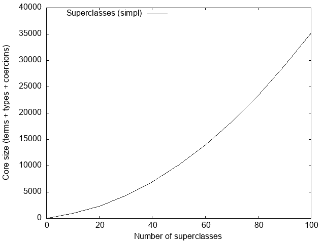
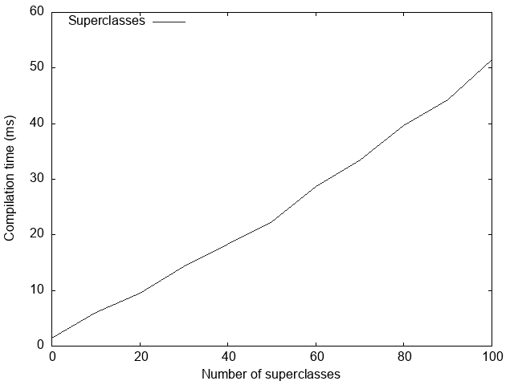

### Applicative chains

This experiment is about the cost of the lack of type sharing, as illustrated
by chains of calls to the `Applicative` operator `<*>`. We discss this in
section [More subtle: types][blogpost1-applicative] of the first blog post.

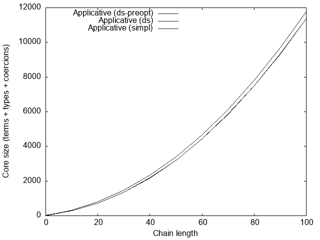

Note: type-level sharing is discussed in more detail in the third blog post on
this topic, [Type-level sharing in Haskell, now][blogpost3]; see also the
corresponding section on [type-level sharing](#type-level-sharing) below.

### Induction

The induction experiment compares the cost of instance induction over lists,
with the cost of instance induction over trees generated _from_ lists, with
or without a phantom argument. This is one of the main topics discussed in
the second blog post, [Induction without core-size blow-up][blogpost2].

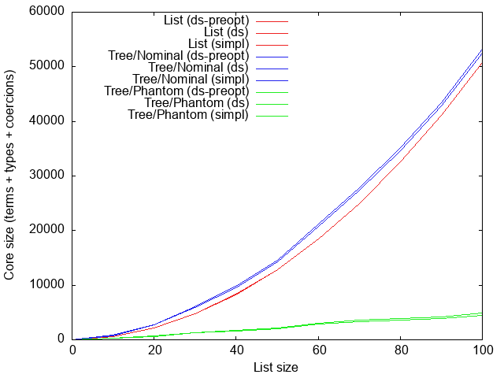

### `Generic` instance for `HList`

This experiment compares a standard [`generic-sop`][generics-sop] generics
instance for `HList` with a [`large-generics`][large-generics] instance using
tree induction and phantom contexts, as explored in the induction experiment
(both instances hand-written). This verifies that the techniques we explored can
in fact be used to construct `Generics` instances that do not result in
quadratic core.

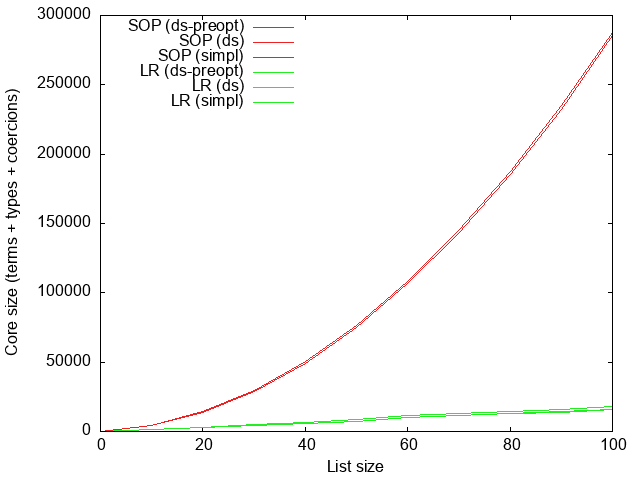

### Constraint families

The problem with constraint families was described in the second blog post,
[Induction without core-size blow-up, a.k.a. Large records: anonymous edition][blogpost2],
section [Constraint Families][blogpost2-CF].

The difference here comes from introducing an intermediate type class to ensure
shallow evaluation. As mentioned in the blog post, this is only visible
before the very simple optimiser runs:

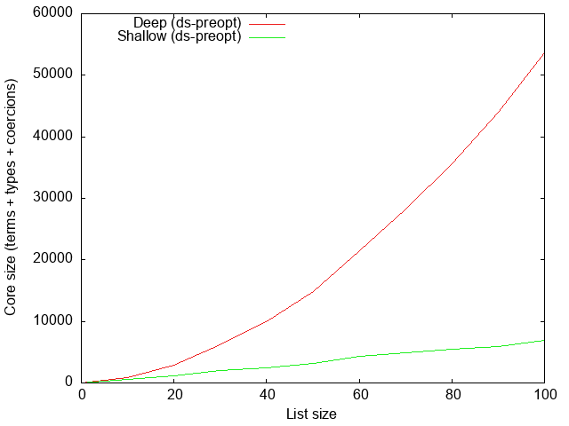

After the optimiser the difference between the two approaches disappears:

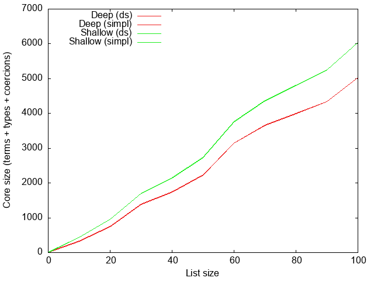

(This experiment assumes an phantom role assigned to `EmptyClass`, as discussed
in the "Induction" experiment.)

As long as we can depend on the very simple optimiser, the difference is not
terribly important:

We nonetheless prefer the shallow approach, in order to limit dependency on the
VSO as much as possible.

### Pre-evaluation

This experiment assesses the feasability of pre-evaluating types, as described
in [Postscript: Pre-evaluating type families][blogpost2-PreEval]. For reference
we have also included the measurements for the regular induction case (without
pre-evaluation, using phantom context). It's clear from these graphs that the
difference is negligible, and so we do not use pre-evaluation at all. It's
mildly interesting that this is a case where phantom contexts are actually
(slightly) worse, however.

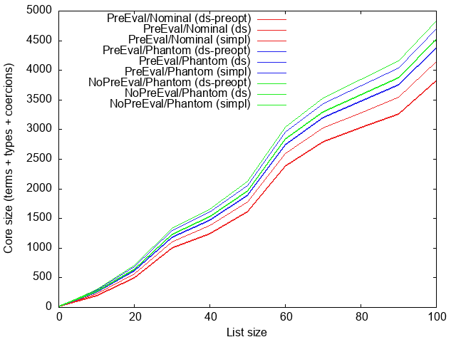
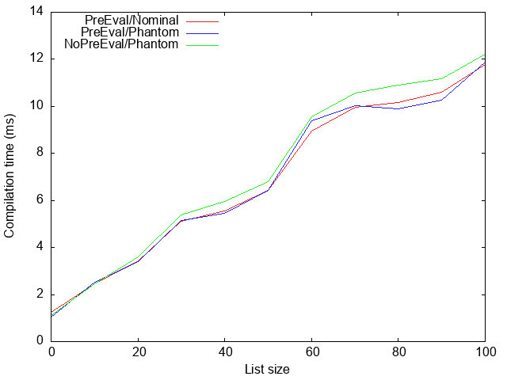

## Type-level sharing

Type-level sharing is discussed in detail
[Type-level sharing in Haskell, now][blogpost3].
We have two benchmarks here: one for the construction of `HList`s and one
for applicative chains; both are discussed in more detail in the blog post.

Unfortunately, although these benchmarks show that the [`typelet`][typelet]
package can indeed help to construct `ghc` core of linear size, they do not
show an improvement in compilation time, at least for these examples.

### HList

For the `HList` benchmarks we have a baseline (no sharing), using `letAs`,
and using `letAs'`, the CPS form of `letAs`.

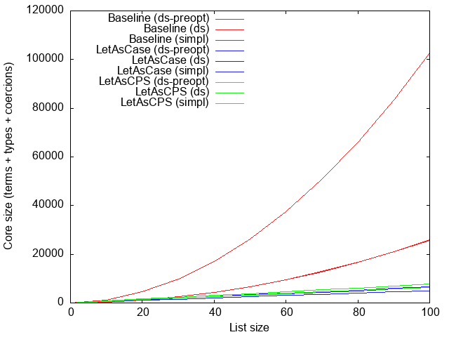
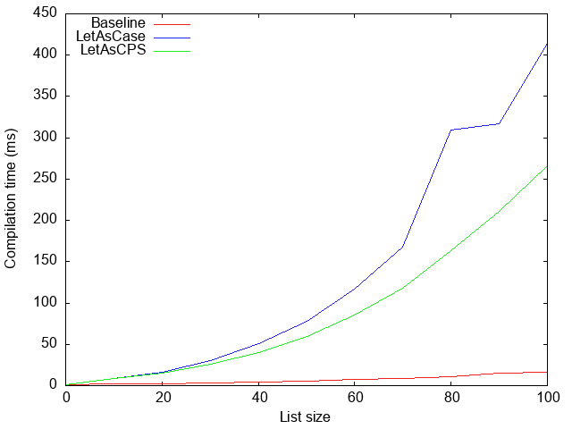

### Applicative chains

For the applicative chains benchmarks we only have a baseline (no sharing),
and one using `let`.

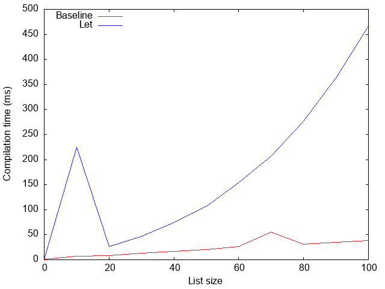

<!-- References -->

[blogpost1-applicative]: https://well-typed.com/blog/2021/08/large-records/#more-subtle-types
[blogpost1-recordaccessors]: https://well-typed.com/blog/2021/08/large-records/#warmup-terms
[blogpost1-superclasses]: https://well-typed.com/blog/2021/08/large-records/#type-class-dictionaries
[blogpost1-transformers]: https://well-typed.com/blog/2021/08/large-records/#transforms
[blogpost1]: https://well-typed.com/blog/2021/08/large-records/
[blogpost2-CF]: https://well-typed.com/blog/2021/10/large-records-part-2/#constraint-families
[blogpost2-PreEval]: https://well-typed.com/blog/2021/10/large-records-part-2/#postscript-pre-evaluating-type-families
[blogpost2]: https://well-typed.com/blog/2021/10/large-records-part-2/
[blogpost3]: https://well-typed.com/blog/2021/12/type-level-sharing-now/
[generics-sop]: https://hackage.haskell.org/package/generics-sop
[HaskellX]: https://skillsmatter.com/skillscasts/17262-avoiding-quadratic-blow-up-during-compilation
[json-sop]: https://hackage.haskell.org/package/json-sop
[large-generics-json]: ../../large-generics/src/Data/Record/Generic/JSON.hs
[large-generics]: ../../large-generics/
[RDP]: https://hackage.haskell.org/package/record-dot-preprocessor
[superrecord]: https://hackage.haskell.org/package/superrecord
[typelet]: https://hackage.haskell.org/package/typelet
[very-simple-optimiser]: https://gitlab.haskell.org/ghc/ghc/-/blob/ghc-8.8.4-release/compiler/coreSyn/CoreOpt.hs#L66-86